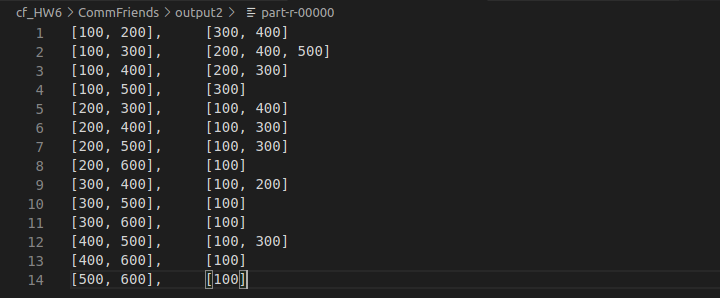

## 设计思路

参考了：https://blog.csdn.net/xuedingkai/article/details/78997928

该作者的思路是Map用于取input的每一行，组合user和其任一好友为key（key中的两个字段按字典序排列），user的所有好友为value，Reduce用于求两个用户之间好友的交集。

但发现该代码与题目要求有所出入，题目要求任意两人的共同好友，该代码求的是好友间的共同好友。

比如：

```java
100, 200 300 400
200, 100 400
300, 100
400, 100
```

按照原文的代码，结果是：

```
[100,200],[300]
[200,400],[100]
```

但按照题目要求，结果应该是：

```
[100,200],[300]
[200,300],[100]
[200,400],[100]
[300,400],[100]
```

基于上次两个job的经验，这次我也在原有基础上加了一个Map和Reduce，用于取每一个user的ID，将第二个Map中user与其好友组合的步骤，替换为user和其他所有人组合，代码就不在这里展示了。


# 代码结果



# 运行截图


## 遇到的问题及解决方案

总体比较顺利没遇到什么大问题，只是作为一个强迫症看到下面的Warning很不爽：


就在前面加了一行注解：

```java
@SuppressWarnings("deprecation")
```

另外还有output删起来很麻烦的问题，用下图的方式在main里把它删掉了：


